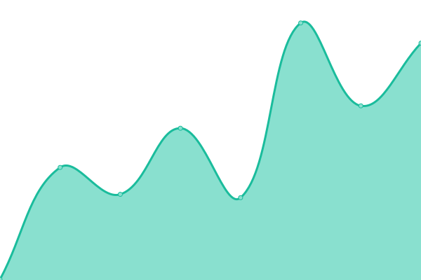

# [📈 Live Status](https://excelerateamerica.com): <!--live status--> **🟧 Partial outage**

This repository contains the open-source uptime monitor and status page for [Excelerate America](https://www.excelerateamerica.com/), powered by [Upptime](https://github.com/upptime/upptime).

With [Upptime](https://upptime.js.org), you can get your own unlimited and free uptime monitor and status page, powered entirely by a GitHub repository. We use [Issues](https://github.com/excelerate-america/eax-upptime/issues) as incident reports, [Actions](https://github.com/excelerate-america/eax-upptime/actions) as uptime monitors, and [Pages](https://excelerateamerica.com) for the status page.

<!--start: status pages-->
<!-- This summary is generated by Upptime (https://github.com/upptime/upptime) -->
<!-- Do not edit this manually, your changes will be overwritten -->
<!-- prettier-ignore -->
| URL | Status | History | Response Time | Uptime |
| --- | ------ | ------- | ------------- | ------ |
|  [hygraph](https://www.hygraph.com) | 🟩 Up | [hygraph.yml](https://github.com/excelerate-america/eax-upptime/commits/HEAD/history/hygraph.yml) | 

 291ms
     
 | 

<a href="https://excelerate-america.github.io/eax-upptime/history/hygraph">100.00%</a>
    

|  [excelerateamerica.com](https://www.excelerateamerica.com) | 🟩 Up | [excelerateamerica-com.yml](https://github.com/excelerate-america/eax-upptime/commits/HEAD/history/excelerateamerica-com.yml) | 

 180ms
     
 | 

<a href="https://excelerate-america.github.io/eax-upptime/history/excelerateamerica-com">100.00%</a>
    

|  [Test Broken Site](https://thissitedoesnotexist.koj.co) | 🟥 Down | [test-broken-site.yml](https://github.com/excelerate-america/eax-upptime/commits/HEAD/history/test-broken-site.yml) | 

 0ms
     
 | 

<a href="https://excelerate-america.github.io/eax-upptime/history/test-broken-site">100.00%</a>
    

<!--end: status pages-->

[**Visit our status website →**](https://excelerateamerica.com)

## 📄 License

- Powered by: [Upptime](https://github.com/upptime/upptime)
- Code: [MIT](./LICENSE) © [Excelerate America](https://www.excelerateamerica.com/)
- Data in the `./history` directory: [Open Database License](https://opendatacommons.org/licenses/odbl/1-0/)
